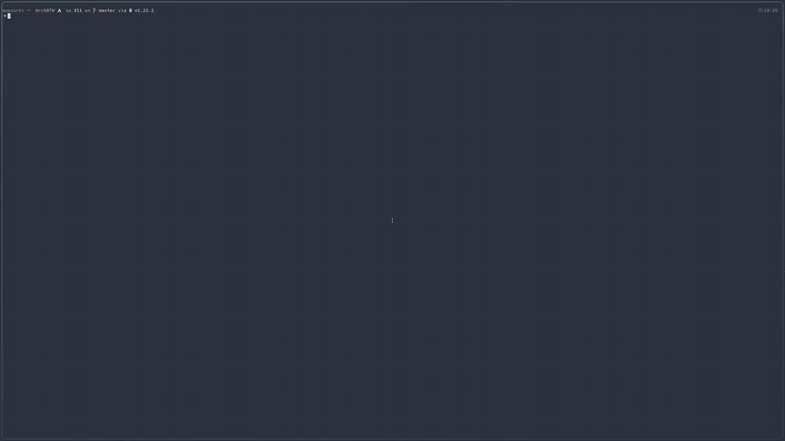
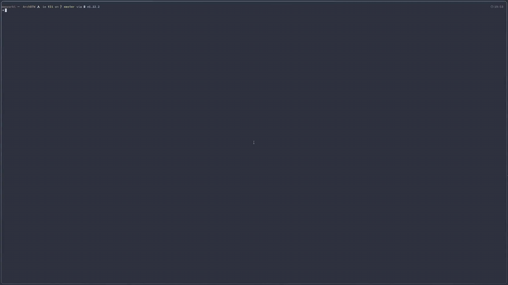

<div align="center" width="100%">
    
</div>
<h2 align="center">TLI - Terminal Log Inspector</h2>

TLI is a simple TUI to work with log files. It's written using go and bubbletea.

# Installation
```
 go install github.com/DebuggerAndrzej/tli@latest
```
Requirements:
- go 1.22 or newer

> [!TIP]
> default installation path for go is ~/go/bin so in order to have tli command available this path has to be added to shell user paths.

# Configuration

### Config file

As for now there is no config file, but it's coming Soon™!

### Flags

- f (string) - space separated string of format indicators (see below, defaults to M which won't parse anything)
- w (string) - warning indicator (default WARN)
- e (string) - error indicator (default ERROR)
- path (string) - relative or absolute path to log file. It has to be at the end of argument list due to go argument parsing. Contents can be also piped using pipe (`|`) operator

#### Defining format

There are 3 format indicators:
- M - message
- T - timestamp
- S - severity

Imagine we have log files in format like this: 

> 2015-10-19 17:40:55,425 INFO Useless  log message string

This line will be splitted by space so we will get slice like this:

> ["2015-10-19", "17:40:55,425", "INFO", "Useless", "log", "message", "string"]

Index:
 - 0 and 1 - timestamps (T)
 - 2 - severity (S)
 - 3 - noise text (there is no specific indicator, but we will go with underscore (_))
 - 4 - 6 - message (M)

Last indicator will exhaust the array so we can set log fomat to: `"T T S _ M"`

# Shortcuts

- `q` - quit
- `f` - weak filter (weak filters are added to regex or)
- `F` - strong filter (always required in message)
- `r` - remove all modifiers (filters, highlihts, searches)
- `/` - search (n next result, N previous result)
- `h` - highlight
- `w` - show only logs with severity warning and above
- `e` - show only logs with severity error
Other than that you can freely use mouse wheel and arrows to navigate through text.

> [!NOTE]
> Filters work on message part of the log! Shortcuts `e` and `w` work only if format flag is set and log severity is known!

# Showcase
## Format
Defining format allows logs to be displayed in cleaner way, remove noises and set severity for logs.


## Search
Search highlights and then using `n|N` lets to go to `next|previous` search result. (navigation wraps around)


## Highlight
Highlights requested text. For each new highlight new color is picked.


## Filters
First two filters are weak filters (regex or, so the first one looks like normal filter) and then strong filter (which won't find any matches) is added and no results are left.


## Severity filtering
If we set in format properly so S (severity) is not empty we can use `e` and `w` shortcuts to show logs only above certain severity.


